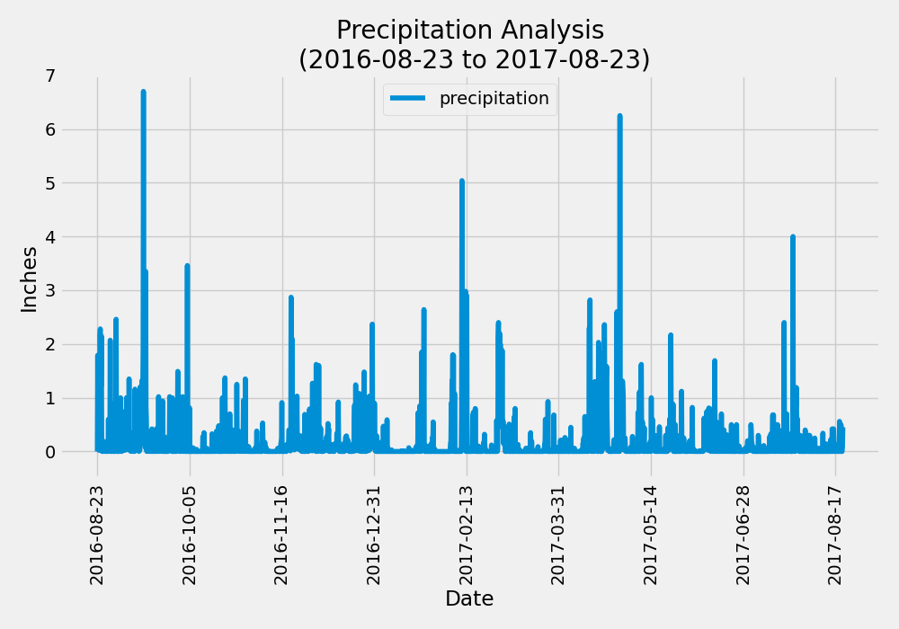
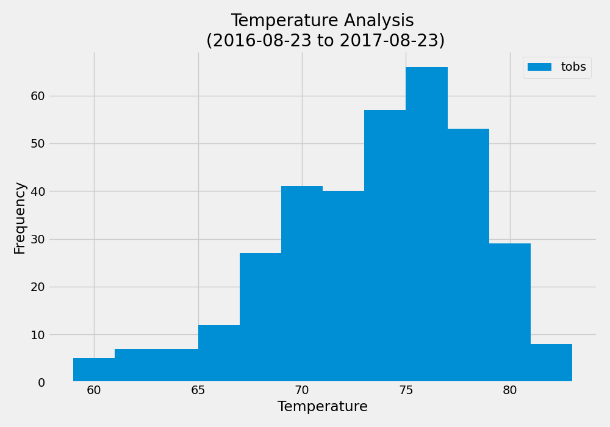

# sqlalchemy-challenge

This challenge we will do a climate analysis of Honolulu, Hawaii to help us plan an extended trip to the island. This will be split into two parts. The first part will be a combination of Python and sqlalchemy utilizing Jypiter notebooks. The second part we will design a Flask API based on the queries we developed in Part 1. 

## Part 1: Analyze and Explore the Climate Data.

- Using files and database provided we use sqlalchemy to connect to the database, create tables into classes, create a session to link Python to the database, and perform precipitation and station analysis. 

- Perform a precipitation analysis from the previous 12 months of data and load into a Pandas Dataframe.

- Plot the results using Matplotlib

- Design a query to find the most active station on the island

- Once the most active station is found we design a query for the previous 12 months of temperature data (TOBS) for that station. 

- Plot the results using a histogram 

## Part 2: Designing Our Climate APP

- Using the queries we developed in our Jypiter Notebook we will design our Flask App in a python file. 

- Design API routes to perform specific queries and return JSON represented dictionary when used. 
    - /api/v1.0/precipitation. This route will query the precipitation data from the previous 12 months.

    - /api/v1.0/stations. This will return a list of stations in our dataset.

    - /api/v1.0/tobs. This will return temperature observations (TOBS) of the most active station from the previous year.

    - /api/v1.0/start and /api/v1.0/start/end. This will return temperature observations (TOBS) from a specified start date and for a given date range. 

- We created a homepage html template to reflect our URL extensions and convert them to hyperlinks. With the help of stack overflow and javascript data we were also able to add input boxes for our start date, and start and end dates.

- Once the user inputs the desired date and submits it will append the API URL with the date or date range submitted. 

